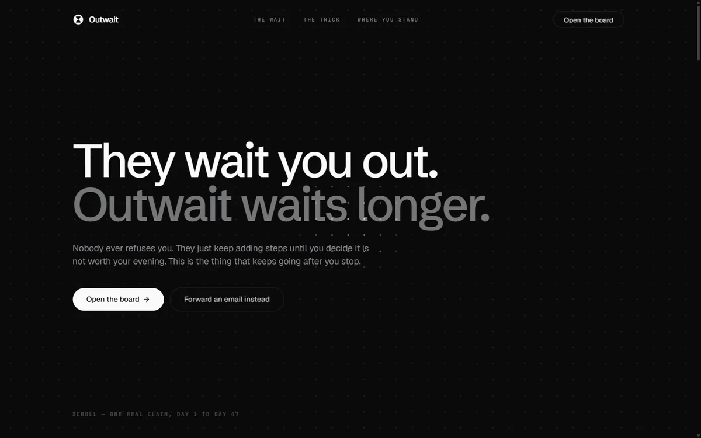
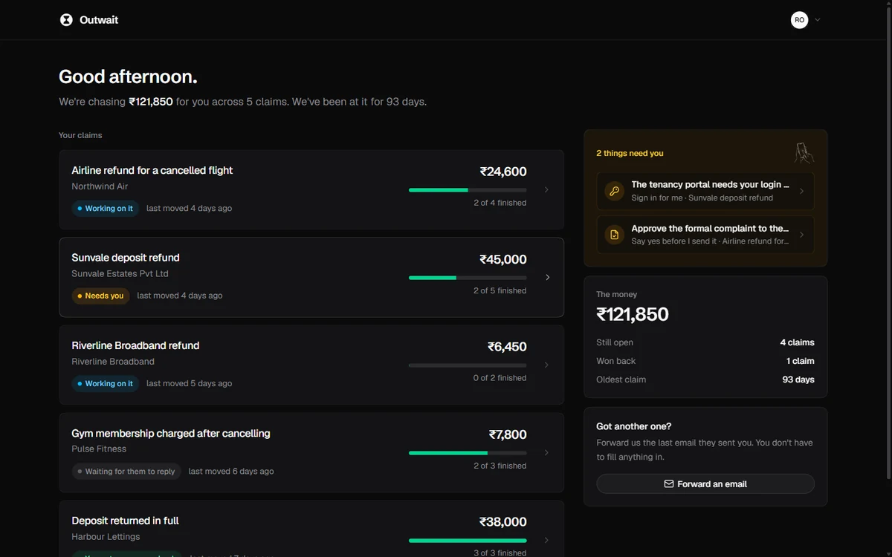
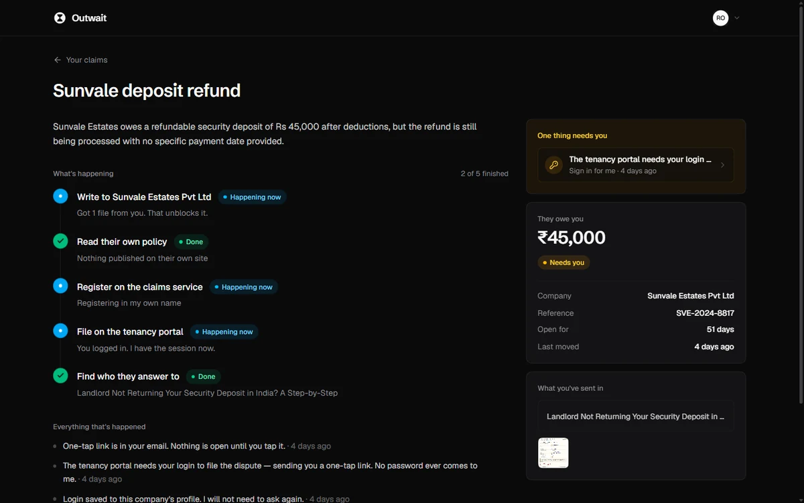
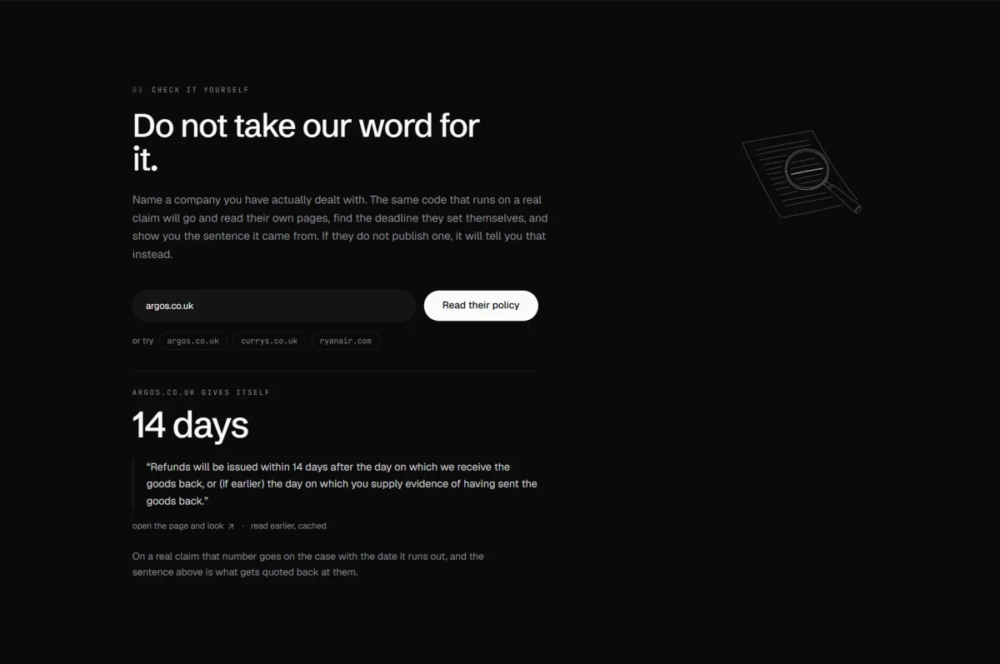
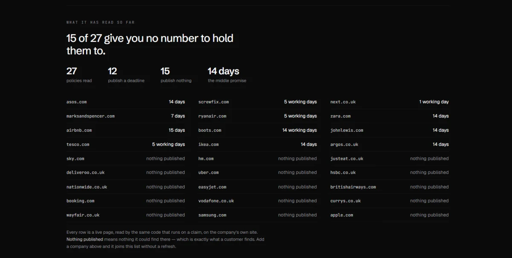
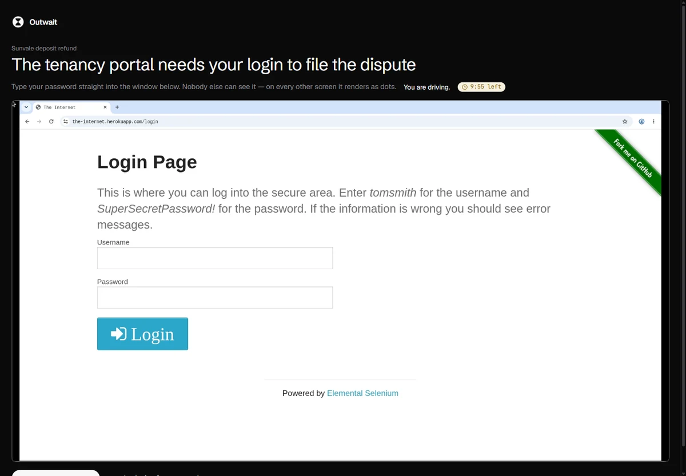

<div align="center">


# Outwait

**They wait you out. Outwait waits longer.**

An agent that chases a company for money they owe you — for weeks, on its own —
and taps you only for the ten seconds that genuinely need a human.

[**Live app**](https://tangible-finch-783.convex.site) ·
[**Watch the demo**](https://youtu.be/M2qJqtPx1tQ) ·
[**Check it yourself**](https://tangible-finch-783.convex.site/#check) ·
[Build log](hackathon.md) ·
[The three boundaries](#the-three-boundaries) ·
[How it works](#how-it-works) ·
[Running it](#running-it)

</div>

---

## The problem, in numbers

Nobody refuses you. They just make getting your money back take longer than you are willing
to spend on it.

In England and Wales alone, **4,706,470 tenancy deposits** are held in protection schemes,
worth a record **£5.53 billion**. The average deposit is **£1,175** — real money to the person
who paid it.

In 2024/25 those schemes carried out **46,950 adjudications. That is 1.00% of protected
deposits.**

> Ninety-nine percent of deposits never reach a dispute.

That is not because ninety-nine percent of landlords return the money cleanly. The same
briefing lists what disputes are actually about — **cleaning (54%)**, **damage (49%)**,
**redecoration (31%)** — the ordinary end-of-tenancy arguments that happen everywhere, not
rare misconduct. And when a case *is* adjudicated, the landlord is rarely handed the lot:
industry analysis of the TDS annual report puts a 100% award to the landlord at around **5%**
of insured cases, with most ending in a split.

So the money is not usually lost because the tenant was wrong. It is lost because pursuing it
is a part-time job, and a normal person quits somewhere around the third email.

<sub>Sources: [TDS Statistical Briefing 2025](https://www.tenancydepositscheme.com/article/TDS-Statistical-Briefing-2025-Key-trends-in-deposits-disputes-and-the-UK-rental-market)
(deposit counts, value, adjudication rate, dispute reasons — figures for England and Wales,
year to March 2025). Award-split figure reported from the TDS annual report by
[The Accommodation Bureau](https://theaccommodationbureau.com). Deposits are the clearest
public dataset; the same shape applies to refunds, delayed payouts and wrongly charged bills,
where no scheme keeps score at all.</sub>

### Why people quit

A claim is not one hard task. It is a long chain of small ones, and every link is a place to
give up:

| The step they add | What it costs you |
|---|---|
| Fill in the online form | Ten minutes, and a reference number |
| Wait ten working days | Two weeks of remembering to check |
| Send the same document again | The suspicion that nobody read the first one |
| "Please call us between 10 and 4" | A working day you do not have |
| Escalate in writing to another team | Starting over, with a new person |

None of it is difficult. All of it is long. **You do not have to outsmart them. You have to
outlast them** — and a machine does not get bored.

---

## What it does

You forward one email. That is the entire setup — no form, no account required to start.

The forward hands over everything a claim needs and a form would have made you retype: the
company's real reply-to address, the reference number, the dates, the amounts and the history.
From there it opens a case, researches the company's own published policy, writes to them,
waits a week, writes again, registers on whatever portal is required, and escalates — for as
long as it takes.

<div align="center">

</div>

### Your claims, and what needs you

The board answers two questions and refuses to ask you anything else: **is anything
happening, and does it need me?**

<div align="center">

</div>

Open one and you get the whole story as a timeline in plain English — no status codes, no
jargon, no log to decode.

<div align="center">

</div>

### Don't take our word for it

The claim this product makes is checkable, so the landing page lets you check it. Name a company
you have actually dealt with and the same code that runs on a real claim goes and reads their own
pages, finds the deadline they set for themselves, and shows you the sentence it came from with a
link. If they publish nothing, it says that instead.

<div align="center">

</div>

No model is in that path. The number is found by anchored regex over the page text and checked
against fixtures of real policy wording — and, more importantly, against the sentences that must
**not** count. Ten kinds of sentence look exactly like a promise and are not one, and every one of
these is real text pulled off a real page:

| What it looks like | What it actually is |
|---|---|
| *"you must return the item within 14 days"* | a deadline on **you** |
| *"you can return new and unopened products within 365 days"* | your return window, offered not obliged — IKEA |
| *"within 30 days of the purchase date"* | a return window again — H&M |
| *"it can take up to five working days for your bank to process it"* | your bank's clock — Argos |
| *"PayPal refunds can take up to 30 days"* | a payment provider's window — Argos |
| *"Mobile phone billing — up to 60 days for the statement"* | the carrier's clock — Apple |
| *"Card approval cancellation within 3-5 business days"* | an authorisation hold releasing — Airbnb |
| *"a refund or flight voucher ... to be used within six months"* | a voucher's shelf life — easyJet |
| *"within 10 days prior to your flight"* | an eligibility window running backwards — Ryanair |
| *"@Carla1984 Automatic refunds can take 6 weeks"* | a community forum post — Sky |

All ten are refused. Each is a fixture: **41 cases** in
`backend/experiments/promise-extraction.test.mjs`, runnable with `node` and no setup.

On a real claim that number lands on the case with the date it runs out, and that sentence is what
gets quoted back at them.

### What we found when we pointed it at 28 companies

The page keeps a public ledger of everything it has been asked to read. It is the product's own
research, not a dataset we loaded: every row is a live page, read by the same code, linked so the
reading can be checked. It is a live Convex query, so a company you look up joins the list in front
of you without a refresh.

<div align="center">

</div>

**20 of 28 set themselves a deadline.** They wrote it down. Only eight — Sky, Vodafone, Uber,
Deliveroo, Just Eat, British Airways, Booking.com and easyJet — name no number at all on their own
refund pages. Of the twenty that do, the middle promise is **14 days**, and the range runs from
Next's **one working day** to Airbnb's **fifteen**.

That is the thesis with a number on it, and it is not the one we expected. The deadline usually
exists. It is just four clicks into a terms page, on the day you are too tired to look, and nobody
is counting from it — so "we are still processing it" holds, indefinitely, against a promise the
company made itself. For those twenty the product goes and finds that sentence and counts the days
from it. For the other eight there is nothing to count from: a company that never names a date can
never be late.

<sub>Method: their own site only, the pages a search for their refund policy actually returns —
the same place a customer would look. Every row here has been read at least twice, because one read
was not enough: a first pass reported eight of these companies as publishing nothing and a second
pass found a published deadline on every one of them — Currys, Apple, Samsung, Wayfair, EE, H&M,
HSBC and Nationwide. Search does not return the same pages twice, and the miss was ours, not
theirs. "Nothing published" now means nothing found on two separate reads, and every reading is
taken again once it is a week old. Community and forum URLs are excluded, because a post by another
customer is not a commitment.</sub>

---

## The three boundaries

Every agent has a human. The only real question is *where that human stands* — and this
product answers it three times. Each answer is a line in the code, not a promise in a prompt.

### 1. It acts as itself

A complaints portal wants an account. The agent registers **in its own name, with its own
email address**, then reads its own verification code out of its own inbox and carries on.

It never holds a credential of yours, because it never needs one.

### 2. It asks before it commits

Anything binding — a formal complaint, a number, a settlement — is written and then **held**
as a draft. It goes out when a person replies "yes" to an email, and there is **no code path
that sends it without one**. The guard is structural, not an instruction the model is asked to
respect.

### 3. It hands you the wheel

When a step needs *your* login, it does not ask for your password.

It sends one link. You tap it on your phone, a **real browser opens inside the page**, you
type your password into the site itself, and the agent carries on in that same session. The
session is created the moment you tap — not when the email was sent — because a browser left
open waiting for you would be dead by the time you arrived.

<div align="center">

</div>

That is a live browser, in the page, with the clock running. Your password is typed into the
real site; on every other screen watching that session it renders as dots. Afterwards the
login is saved against that company, so it never has to ask you twice.

**Ten seconds of your attention, once per company, forever.**

---

## How it works

```
  forward an email
         │
         ▼
   signed webhook ──► verify ──► store ──► 204        (answer fast, think after)
         │
         ▼
   read the letter ──► open a case + its tracks       (one file calls a model)
         │
         ├──► research the company's own policy       Firecrawl
         ├──► write to them, wait a week, write again  durable workflow
         ├──► register on a portal as itself           Firecrawl + own inbox
         └──► when it truly needs you ──► one email    AgentMail
                                              │
                                              ▼
                              reply "yes" · send a photo · tap a link
```

Everything the demo depends on is deterministic. **One file calls a model**
(`convex/agent/model.ts`, two named jobs) and it only ever turns prose into structured fields.
The case shape, which tracks open, what the board says and what gets sent are all plain
mutations — so the same email always produces the same case.

---

## Built on

### Convex — the backend, and most of the product

Not a database with a server bolted on. The parts of this that would normally be
infrastructure are Convex features, which is why a solo build could reach this scope.

| What | Where |
|---|---|
| **Durable workflows** — `step.sleep` for 7 days, three times, then escalation. A chase that survives restarts and costs nothing while it waits. | `convex/workflows/chase.ts` · `@convex-dev/workflow` |
| **Realtime queries** — one subscription drives the whole board. Mail lands, the screen moves. Nobody refreshes. | `convex/cases.ts` |
| **HTTP actions** — the inbound mail webhook, with hand-written Svix signature verification (Web Crypto, because HTTP actions are not Node). | `convex/http.ts` · `convex/lib/svix.ts` |
| **Scheduled functions** — answer the webhook in 204, then think. A slow webhook gets retried, and a retry would open the case twice. | `convex/http.ts` |
| **Auth** — sign in with a six-digit code, no password anywhere. | `convex/auth.ts` · `@convex-dev/auth` |
| **Presence** — three flatmates, one deposit: see who else is on a case and who is holding the wheel. | `convex/presence.ts` · `@convex-dev/presence` |
| **File storage** — reply to an email with a photo of a receipt and it becomes evidence on the case. | `convex/mail/client.ts` |
| **Static hosting** — the whole frontend served from the same deployment. | `@convex-dev/static-hosting` |

Three registered components, plus auth. `convex/lib/status.ts` derives case status from the
rows themselves rather than letting each blocker assign it — which removed a whole class of
bug where clearing one blocker wrongly cleared the case.

### Firecrawl — reading the web, and operating it

Two different jobs, and the second one is the interesting one.

- **Reading.** `/v2/search` finds the company's own published pages and `/v2/scrape` renders and
  reads them, so a letter can quote their own deadline back at them. Guarded twice: text is only
  attached when the page hostname matches the company on the case — after an unrelated business's
  refund policy was once stored as if it were theirs — and the number itself comes out by regex,
  never a model. This is also what powers
  [Check it yourself](https://tangible-finch-783.convex.site/#check), where anyone can point the
  same code at any company and watch it work, cached by hostname so it costs a credit once.
- **Operating.** `/interact` drives a real browser to fill in portals — and
  `interactiveLiveViewUrl` is what makes boundary 3 possible: the same live session handed to
  a human, mid-flight, then handed back. Named profiles persist the login so it is asked for
  once per company.

A finding worth passing on: **the profile write is asynchronous.** Reading a profile back too
soon returns an empty one — 0 of 3 sessions reused the login with no wait, 3 of 3 with a
settle. That only showed up by measuring it.

### AgentMail — the agent's own identity

The product reaches people by email, so email is not a notification channel here. It is the
interface.

- **Its own inbox and address** — which is what lets the agent sign up for things as itself,
  and read its own verification codes.
- **Inbound webhook, Svix-signed** — a forwarded email becomes a case. Unsigned and forged
  deliveries are rejected.
- **Threads as case files** — a reply lands back on the right case with no reference number
  to quote.
- **Drafts as the approval gate** — boundary 2 is an AgentMail draft that is held until a
  human says yes.
- **Sign-in codes** — the same inbox that chases companies also sends your login code.

Verification codes are pulled out of mail by anchored regex rather than a model, checked
against a fixture set of real and decoy messages, because sign-in should not depend on a
model's mood.

### OpenAI — reading prose, and nothing else

`openai/gpt-5.6-luna` via OpenRouter, in exactly one file, doing two named jobs: turn a
forwarded email into structured case fields, and classify a reply as yes / no / neither.

Everything downstream is deterministic on purpose. A demo that depends on a model agreeing
with you is a demo that fails live.

---

## Running it

Three independent npm projects, no workspaces.

```
backend/     the Convex app — schema, functions, the agent loop, workflows
frontend/    Vite + React + shadcn/ui, builds to frontend/dist
component/   reserved for a publishable Firecrawl /interact component
```

```bash
# backend
cd backend
npm install
cp .env.example .env.local        # then fill it in
npx convex dev

# frontend, second terminal
cd frontend
npm install
npm run dev
```

Deploy backend and static site together, from `backend/`:

```bash
npm run deploy
```

Credentials live only as Convex environment variables, never in the repo:
`FIRECRAWL_API_KEY`, `AGENTMAIL_API_KEY`, `AGENTMAIL_WEBHOOK_SECRET`, `OPENROUTER_API_KEY`,
`MODEL_ID`. Names are in `backend/.env.example`.

---

## Where it goes next

Honest about today, and each of these is the natural next build rather than a hole.

**Phone calls.** When a company insists on a call, it puts the same thing in writing instead —
usually the stronger move, since writing leaves a record. A voice agent that sits on hold and
reads out the reference number is the obvious extension, and hold time is exactly the kind of
cost a machine should absorb.

**A visible schedule.** The chase already runs on a durable workflow that sleeps for weeks.
Surfacing that as a dated plan — *"I write again on the 26th; if nothing by the 3rd, I file
with the ombudsman"* — turns waiting from an absence into something you can see coming.

**Watching the promise change.** A company quietly editing its own turnaround from 14 days to 30
is exactly the kind of thing nobody notices, because the old page is gone the moment it is saved.
The sentence and the date it was read are already stored, so keeping every version and telling
people when one moves is a small step from here — and it would make a category of quiet
rule-changing visible for the first time.

**Sessions that outlive the site's own.** A saved login lasts only as long as the company's
session does — minutes at a bank, months at a small portal. Re-authenticating without asking
again, where the site permits it, is the difference between ten seconds once and ten seconds
occasionally.

**Companies with good self-service.** Amazon already refunds you in two clicks and needs none
of this. The product is aimed squarely at the ones that do not, and the addressable gap is
every company that made a process long on purpose.

**This is not legal advice** and never claims to be. The claim is narrower and, we think,
more useful: it chases, it keeps a record, and it does not get bored.

---

<div align="center">

Built for the [Convex All Gas Hackathon](https://vibeapps.dev/tag/allgashackathon).

Convex · OpenAI · Firecrawl · AgentMail

</div>
